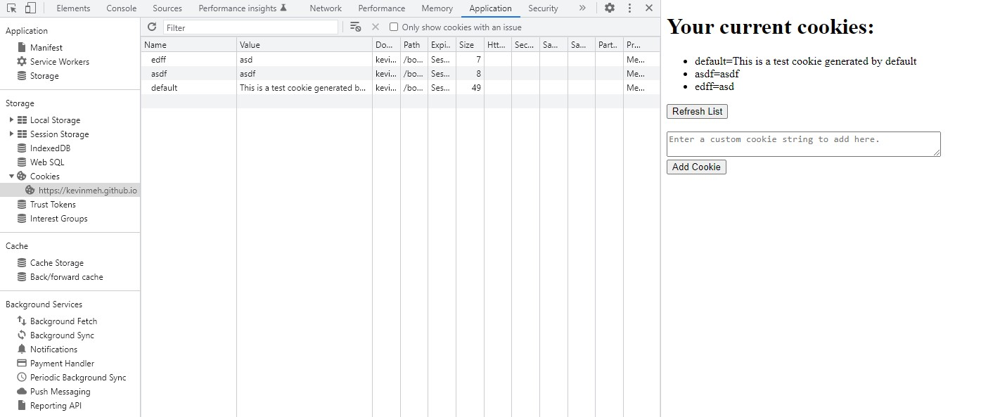
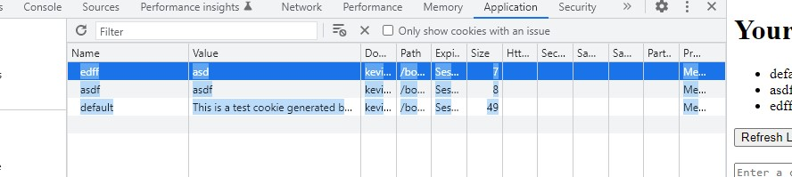
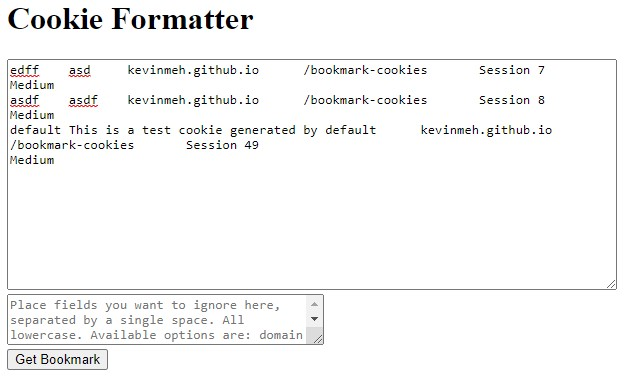
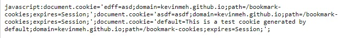

# bookmark-cookies

This is a website that helps you format and inject cookies onto a page using JavaScript.

## How to Use

1. Open up Developer Tools on the website you wish to take cookies from. Navigate to the `Application` panel and select the website from the `Cookies` drop down.

2. Drag your mouse over the cookies you wish to inject and copy the text.

3. Go to this [page here,](https://kevinmeh.github.io/bookmark-cookies/generate.html) and paste the string into the textbox. ( https://kevinmeh.github.io/bookmark-cookies/generate.html )
4. If there are any fields that you wish to exclude from the generated list, put them into the 2nd textbox. If you want to include everything, leave it blank.

5. Press `Get Bookmark` and voila! There's your JavaScript cookie injection string.

## Injecting Cookies

To inject cookies on a desktop browser, simply open up Developer Tools, navigate to the console, and paste the string in.

On mobile devices, you'll need to use a bookmark. Go to the page that you want to inject cookies to, create a new bookmark, and in the URL section, paste the injection script in. Then, use the bookmark, and reload the page if necessary. This works on most browsers, including Safari and Chrome.

## Learn More

[Cookies and JavaScript](https://developer.mozilla.org/en-US/docs/Web/API/Document/cookie)
